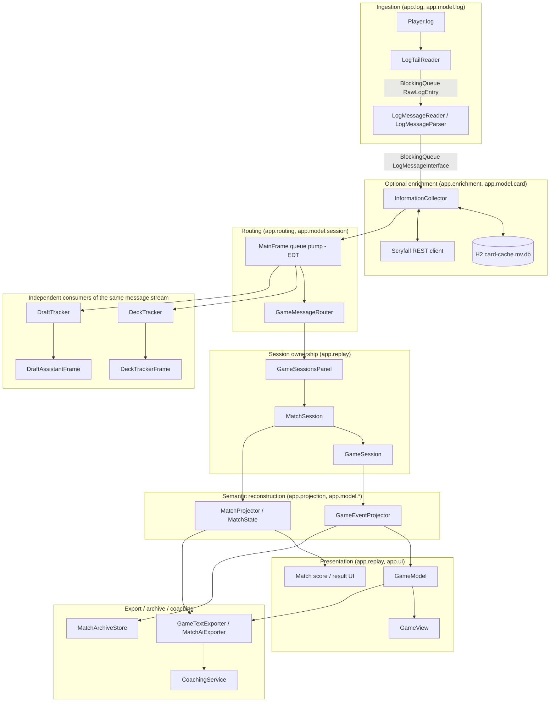
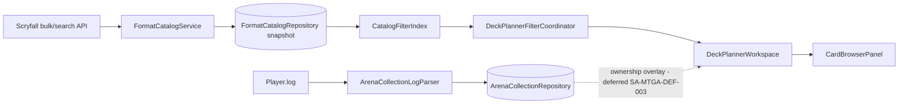
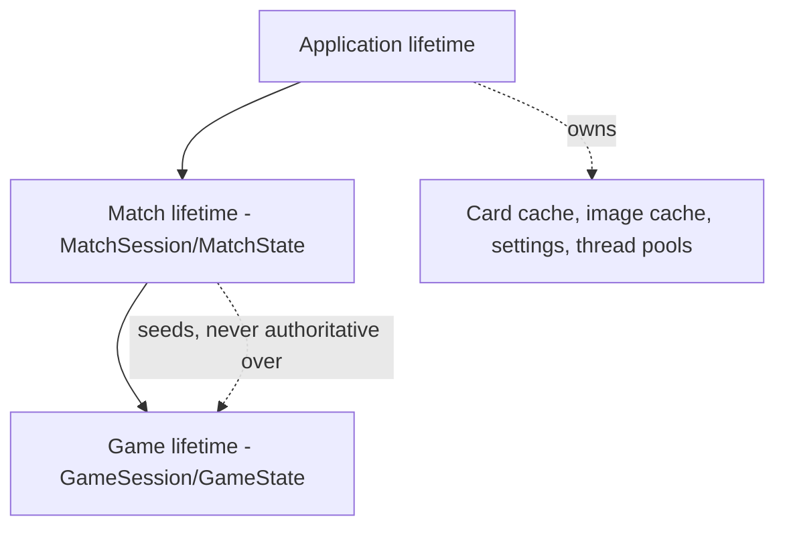
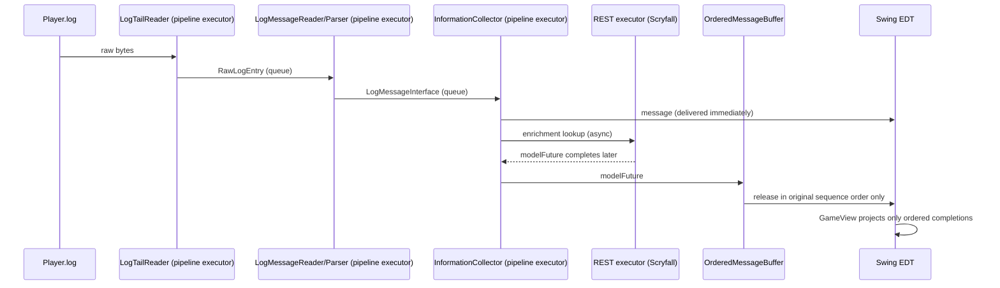
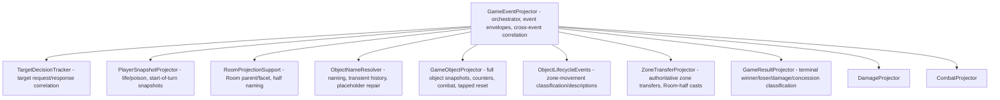

# Architectural Analysis (Claude)

## Purpose of this document

This is an independent architectural description and analysis of MTGArenaLogReader,
produced by Claude for use as a second opinion alongside the project's other
architecture documents (`docs/architecture/current-state.md`,
`docs/architecture/match-support.md`) and any other agent-authored analyses placed
under `docs/architecture/<agent-name>/`.

The repository owner works with multiple AI agents on this codebase and needs a
record of what each agent independently observed, so that disagreements between
agents can be arbitrated deliberately rather than lost. This document therefore
favors explicit claims and diagrams over prose that would be hard to compare
against a differently-worded analysis from another model. It does not modify any
source code, and it does not attempt to restate `current-state.md` — it is a
fresh read of the repository, cross-checked against the existing documents only
after forming independent conclusions.

Companion documents in this folder:

- `review.md` — an evaluative review of the architecture (what is sound, what is
  risky, what is inconsistent between stated intent and code).
- `improvements.md` — concrete, prioritized suggestions for improving the
  architecture.

## What the system is

MTGArenaLogReader is a Java 24 / Swing desktop application that tails MTG
Arena's `Player.log`, reconstructs semantic game and match state from Arena's
JSON telemetry, and presents that state through several independent Swing
tools sharing one ingestion pipeline:

- a live/replay game and match viewer,
- a deck tracker,
- a draft assistant,
- a manual coaching workflow,
- a "Deck Planner" catalog/filter/consideration workspace (an actively evolving
  arc at the time of this analysis, per `.steadyarc/roadmap.md`).

The project is Windows-oriented (DPAPI-backed secret storage, `Player.log`
path conventions) but the core reconstruction logic has no Windows dependency.

## High-level architecture

Independently of the ingestion pipeline, the Deck Planner arc is a
self-contained catalog/filter/browse subsystem (`app.deckplanner.*`) that talks
to Scryfall and an Arena collection-observation parser, but is not wired into
the live `Player.log` reconstruction pipeline described above — it consumes
Arena log records for collection ownership only, and otherwise operates on
Scryfall catalog data fetched independently.

## Lifetime model

The codebase enforces three nested lifetimes, and this is the single most
important architectural invariant in the system:

- **Application**: settings, card/image caches, thread pools, repositories.
- **Match**: participant identity, local-player role, score, registered deck,
  reusable card-identity knowledge.
- **Game**: zones, objects, battlefield, combat, opening hand, pending
  correlation state — all discarded at game boundaries.

A shorter lifetime may consume knowledge from a longer one; it must never leak
state upward except as durably-valid knowledge. This is documented
prescriptively in `match-support.md` and is largely realized in
`GameMessageRouter` → `MatchSession` → `GameSession`.

## Concurrency model

Three bounded `BlockingQueue`s provide back-pressure. A message can be
*delivered* before its enrichment `modelFuture` resolves, but
`OrderedMessageBuffer` guarantees consumers only ever observe completions in
original Arena sequence order — this is the mechanism that lets asynchronous
Scryfall lookups run in parallel without corrupting gameplay ordering. All
Swing mutation is expected to happen on the EDT; mutable shared session models
expose synchronized mutation/snapshot boundaries.

## Package/responsibility map

| Layer | Packages | Owns |
|---|---|---|
| Composition root | `app.application` | Wiring, startup/shutdown of every subsystem |
| Ingestion | `app.log`, `app.model.log` | Tailing, framing, filtering, decoding |
| Enrichment | `app.enrichment`, `app.model.card` | Scryfall metadata, caches, aliasing |
| Routing | `app.routing`, `app.model.session` | matchId/gameNumber based dispatch |
| Reconstruction | `app.projection`, `app.model.game/event/match` | Canonical state, semantic events |
| Presentation (replay) | `app.replay`, `app.ui` | Swing rendering, interaction |
| Deck tracking | `app.deck.*` | Deck parsing, persistence, draw/probability tracking |
| Draft assistance | `app.draft.*` | Draft parsing, ranking, UI, export |
| Deck Planner | `app.deckplanner.*` | Catalog, filter index, responsive browser UI |
| Export/archive | `app.export`, `app.archive` | Serialization, match archiving |
| Coaching | `app.coaching.*` | Conversation persistence, prompt construction |
| Settings | `app.settings` | Theme, DPAPI-backed secrets |
| Dev tooling | `devtools` | Standalone preview harnesses, not production code paths |

Notably, `app.deckplanner`, `app.draft`, `app.deck`, and `app.coaching` are four
structurally similar "vertical slices" (catalog/parsing → model → persistence →
UI), each maintained largely independently, with their own model types, their
own repository/persistence pattern, and their own Swing frame. This is a
repeated shape worth naming explicitly (see `review.md`).

## Reconstruction internals (`app.projection`)

`GameEventProjector` (1075 lines) is the orchestrator for per-game semantic
reconstruction. It already delegates to a set of focused collaborators:

This is a plausible decomposition — each collaborator owns one concern — but
`GameEventProjector` itself remains the largest file in the codebase by a wide
margin (next-largest source file is `MatchAiExporter.java` at 783 lines,
followed by `ReplayFragmentRenderer.java` at 700 and `GameView.java` at 627).
The project's own `current-state.md` already names this as the primary
"current design pressure," which this analysis independently corroborates by
line count and by reading the collaborator list above.

## Persistence

| Data | Mechanism | Location |
|---|---|---|
| Scryfall card metadata, deck cache | Embedded H2 | `~/.arena-log-viewer/card-cache.mv.db` |
| Card images | Filesystem | `~/.arena-log-viewer/images/` |
| Match archives | Filesystem exports | `~/.arena-log-viewer/archive/` |
| Coaching conversations | Embedded persistence repository | `~/.arena-log-viewer/coaching/` |
| Draft rankings | Filesystem repository | `~/.arena-log-viewer/draft-rankings/` |
| Ability names, theme | Java Preferences | Platform preference store |
| Deck Planner catalog snapshots | `FormatCatalogRepository`, versioned/resumable | Filesystem |
| Arena collection ownership | `ArenaCollectionRepository` | In-memory/persisted snapshot with provenance |

Scryfall is the only outbound network dependency. There is no server component;
this is a single-user local desktop tool.

## Testing posture

- JUnit 5, 88 test source files as of this analysis.
- `src/test/resources/logs/multigame.log` is treated as an immutable end-to-end
  fixture; `ArenaLogReplayHarness` drives production framing/parsing/routing/
  projection code without Swing or network.
- Deck Planner has its own rendered-fixture and human-review harness pattern
  (`DeckPlannerCardBrowserPreview`, `PreviewDeckPlannerCardBrowser.ps1`)
  distinguishing structural test evidence from human visual sign-off — this is
  a deliberate, documented practice (see `.steadyarc/engineering-notes.md`) and
  a good one, discussed further in `review.md`.

## Process/governance layer (Steady Arc)

Distinct from the application architecture itself, this repository layers a
"Steady Arc" process on top: `.steadyarc/handoff.md`, `.steadyarc/roadmap.md`,
`.steadyarc/engineering-notes.md`, and `AGENTS.md` define how AI coding agents
receive bounded delegated authority, what evidence is required before marking
work complete (contract vs. integration vs. rendered-fixture vs. human-visual),
and how continuation state survives across agent sessions. This is itself an
architectural decision worth treating as a first-class subject of review,
because it directly shapes how safely multiple agents (including this one) can
operate on the codebase concurrently — see `review.md` for an assessment of
this layer specifically.
