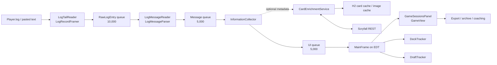
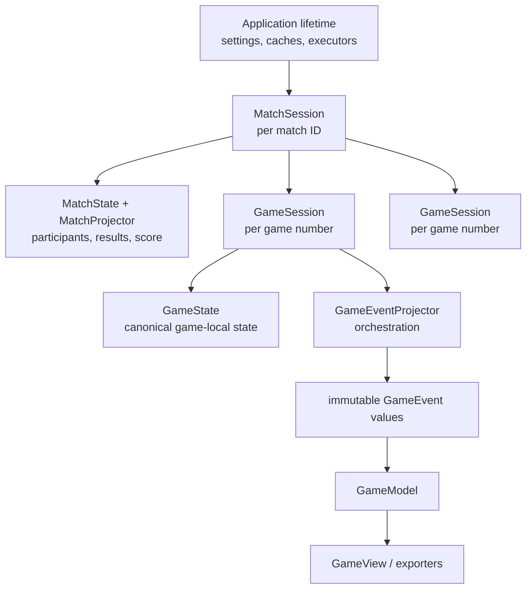

# GPT Terra Architecture Analysis

## Scope and authority

This is a code-informed analysis captured on 2026-08-07. It complements, but
does not replace, the maintained [current architecture](../current-state.md),
the match-lifetime contract in [match support](../match-support.md), or the
Steady Arc decisions in `.steadyarc/`. The Maven build targets Java 21; the
README's Java 24 wording should not be treated as the build contract.

MTGArenaLogReader is a Windows-oriented Swing desktop application. It tails
MTG Arena's `Player.log`, reconstructs games and matches from Arena
observations, optionally enriches cards with Scryfall metadata, and exposes
replay, deck tracking, draft assistance, export, and manual coaching features.

## System shape

`Application` is the composition root. It owns three bounded queues, a
three-thread pipeline executor, a two-thread REST executor, caches,
repositories, and shutdown. The application has no dependency-injection
container; construction is explicit and centralized in
`app.application.Application`.

## Processing pipeline

1. **Ingestion (`app.log`)** — `LogTailReader` tails or rescans the log.
   `LogRecordFramer` handles multiline JSON while respecting quoted strings;
   filtering occurs after a complete root object or array is framed.
2. **Parsing (`app.log`, `app.model.log`)** — `LogMessageReader` turns
   `RawLogEntry` records into typed `LogMessageInterface` instances and
   identifies referenced Arena card IDs. `ArenaCollectionObserver` receives
   collection observations before normal gameplay consumers.
3. **Enrichment (`app.enrichment`)** — `InformationCollector` immediately
   forwards the Arena message, then resolves card data asynchronously through
   `CardEnrichmentService`. Lookup order is memory/cache/Scryfall. Failure
   completes the model future exceptionally but does not stop the Arena
   message from progressing.
4. **UI fan-out (`app.replay`)** — a Swing timer drains batches from the UI
   queue. The same ordered message stream feeds replay, deck tracking, and
   draft tracking.
5. **Replay ordering** — `GameView` uses `OrderedMessageBuffer` to hold
   messages until enrichment futures complete, then releases them in original
   sequence order. This prevents asynchronous HTTP completion from rewriting
   game chronology.

Arena observations are authoritative for gameplay and account facts. Scryfall
is descriptive enrichment only; it can provide card rules, images, and
legality but must not manufacture gameplay events or ownership.

## Replay reconstruction and lifetimes

`GameMessageRouter` learns the active `matchId` and `gameNumber` from the
ordered Arena records and produces a `GameKey`. `GameSessionsPanel` creates a
`MatchSession` per match ID and a fresh `GameSession` per game number.

The lifetime split is central:

| Lifetime | Owns | Must not retain |
| --- | --- | --- |
| Application | caches, executors, settings, repositories | game-specific state |
| Match | participants, score, results, reusable match knowledge | prior game board state |
| Game | zones, objects, aliases, combat, turn state, correlations | data from a different game |

`GameEventProjector` is the semantic orchestration boundary. It maintains the
canonical `GameState` and delegates focused work to collaborators including
object identity, object snapshots, attachments, counters, combat, damage,
token resolution, opening-hand tracking, target decisions, zone transitions,
player snapshots, and results. Its output is structured `GameEvent` values;
views and exporters consume those values rather than reparsing Arena JSON.

## Feature subsystems

| Area | Primary packages | Responsibility |
| --- | --- | --- |
| Replay | `app.routing`, `app.projection`, `app.replay` | Route messages, reconstruct canonical state, render timelines and snapshots. |
| Card enrichment | `app.enrichment`, `app.model.card` | Cache and retrieve Scryfall card metadata and images. |
| Deck tracking | `app.deck` | Parse deck observations, retain deck state, calculate live tracker views. |
| Draft assistance | `app.draft` | Parse draft events, maintain a draft model, rank cards, and export context. |
| Coaching | `app.coaching` | Persist local conversations and construct copy/paste prompts from canonical exports. |
| Deck planner | `app.deckplanner` | Maintain resumable format catalogs, filter cards, and provide responsive planner controls. |
| Settings/UI foundation | `app.settings`, `app.ui` | Themes, DPAPI-backed secret storage, and reusable Swing components. |

The Deck Planner deliberately has a separate truth pipeline. `FormatCatalogService`
retrieves Arena-legal Scryfall catalog pages sequentially, stages results in
`FormatCatalogRepository`, and publishes only complete snapshots. Collection
quantities are separate: `-1` unknown, `0` authoritatively absent, and positive
values observed. `DeckPlannerFilterCoordinator` runs filtering and tag-count
work off the EDT, cancels or suppresses stale generations, and returns view
state changes on the EDT.

## Concurrency and persistence

| Concern | Design |
| --- | --- |
| Back-pressure | Bounded `BlockingQueue` stages isolate tailing, parsing, enrichment, and UI delivery. |
| Background work | Pipeline workers handle log stages; REST workers handle enrichment, image work, and catalog-related work. |
| Swing safety | UI mutations and result deliveries are marshalled to the EDT. |
| Ordering | Sequence numbers plus `OrderedMessageBuffer` preserve replay order across asynchronous enrichment. |
| Shared mutable models | Session/model snapshot APIs use synchronization where state crosses boundaries. |
| Metadata persistence | H2 stores card and deck data under `~/.arena-log-viewer/`; card images and archives use the filesystem. |
| User data | Coaching, draft rankings, preferences, and secrets use their dedicated repositories or platform preference/DPAPI services. |

The architecture is therefore a staged event-processing desktop application:
asynchronous at I/O boundaries, ordered at semantic reconstruction, and
single-threaded at the Swing presentation boundary.
