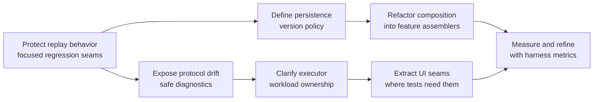

# GPT Terra Improvement Suggestions

## Decision principles

These recommendations preserve the current architecture's strongest
constraints: Arena remains authoritative, replay remains ordered, game state
does not cross game boundaries, and expensive work stays off the Swing EDT.
They are proposals, not approved roadmap items.

## Prioritized improvements

| Priority | Recommendation | Architectural outcome | Avoid |
| --- | --- | --- | --- |
| 1 | Define narrow regression seams around `GameEventProjector`'s remaining orchestration policies. | Makes rule-precedence changes reviewable through stable input/event/state expectations. | A broad rewrite or a second reconstruction pipeline. |
| 1 | Add structured, rate-limited diagnostics for unsupported or ignored Arena record shapes. | Makes protocol drift visible without turning ordinary malformed input into a fatal error. | Logging complete raw records or sensitive player data by default. |
| 1 | Establish a uniform persistence-version and migration policy across repositories. | Makes upgrade behavior explicit for H2 schemas, filesystem payloads, and planner snapshots. | One global schema abstraction that hides each storage format's real lifecycle. |
| 2 | Split application composition into explicit feature assemblers while retaining `Application` as lifecycle owner. | Reduces constructor/wiring density and allows subsystem composition tests. | Introducing a dependency-injection framework unless a concrete need emerges. |
| 2 | Make executor ownership and workload budgets visible at subsystem boundaries. | Prevents catalog, image, enrichment, and ad-hoc work from accidentally competing without an intentional policy. | Increasing parallelism blindly; Scryfall throttling and cancellation remain required. |
| 2 | Extract stable host interfaces from UI hotspots where collaborators already exist. | Allows renderer/interaction behavior to be tested separately from `GameView` and frame wiring. | Replacing custom virtualized painting with per-event Swing component trees. |
| 3 | Introduce a compact architectural decision record practice for new cross-cutting choices. | Gives agents a canonical place for the rationale behind concurrency, truth, or identity decisions. | Duplicating existing Steady Arc handoff, roadmap, or engineering-note authority. |
| 3 | Add operational metrics to developer/test harnesses for queue depth, enrichment delay, and stale-work cancellation. | Supplies evidence for responsiveness changes and capacity decisions. | Shipping noisy diagnostics or collecting user log contents as telemetry. |

## Suggested sequencing

### 1. Protect semantic reconstruction before reshaping it

Continue extracting a collaborator only when it has a clear state owner, a
narrow input/output contract, and focused replay-fixture coverage. For each
remaining `GameEventProjector` policy, document:

- the Arena evidence it consumes;
- the canonical state it may mutate;
- the structured event(s) it may emit;
- ordering/precedence rules; and
- ambiguous or unsupported cases.

This gives agents a concrete basis to debate extraction versus retention. The
correct default is a small, evidence-backed extraction, not a rewrite.

### 2. Improve protocol-drift observability safely

Add counters or concise diagnostic categories for records that cannot be
routed, parsed, or projected, with sampling/rate limiting. Include the record
shape/category and reason, not raw player identifiers or full log content.
Expose this in developer diagnostics or test assertions first. This preserves
the current resilience while giving maintainers evidence when Arena changes a
wire shape.

### 3. Standardize persistence evolution

Inventory each repository's format, version marker, migration path, recovery
behavior, and compatibility test. New persisted data should declare:

1. an explicit format/schema version;
2. what older versions do;
3. atomic-write or transaction expectations;
4. corruption/recovery handling; and
5. a focused upgrade test.

The existing catalog staging/publish approach is a good model: an interrupted
refresh must not replace the last complete usable state.

### 4. Bound background workload intentionally

Document which executor owns tailing, parsing, enrichment, images, catalog
refresh, and developer actions. Add a small ownership abstraction only if
measurements show harmful contention. Retain cancellation, rate limiting, and
generation checks; they are more valuable than simply adding threads.

### 5. Decompose UI through tested seams, not framework replacement

Where a frame/view remains difficult to change, extract the smallest
presentation-neutral collaborator that owns one policy: layout, selection,
hit testing, status mapping, or action dispatch. Validate it with structural
tests and, for visible changes, rendered fixtures and human review. The Deck
Planner's layout, viewport, image-source, and filter-coordinator boundaries
are useful examples of this approach.

## Agent-arbitration rubric

When agents disagree about an architectural change, assess the proposal in this
order:

1. **Truth:** Does it preserve the Arena-versus-Scryfall authority boundary?
2. **Lifetime:** Does it put state at application, match, game, or view scope
   correctly?
3. **Order and threading:** Does it preserve message order and EDT confinement?
4. **Contract:** Does it keep structured models/events as the consumer boundary?
5. **Evidence:** Which focused test, integration fixture, rendered fixture, or
   human review would prove the claimed behavior?
6. **Scope:** Is it a bounded extraction or an unnecessary architecture rewrite?

Prefer the option that satisfies these constraints with the smallest new
abstraction and a measurable validation path.
